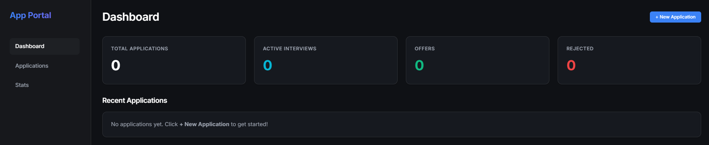
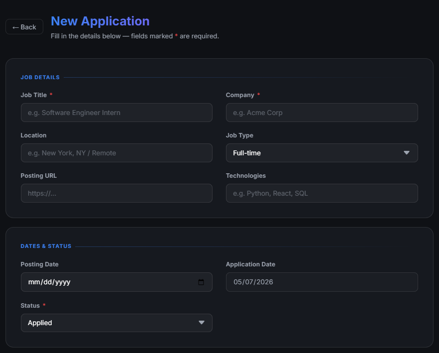

# Job Application Portal

A simple job application tracker designed for full control over your applications. This portal combines a **glassmorphic** web interface with an alternative **CLI** manager for maximum flexibility in logging your career journey.

*Originally started as a personal project.* 




## Core Features

### Simple Web Interface
- **Dynamic Dashboard**: Real-time statistics, application status distributions, and active application lists.
- **Glassmorphic Design**: A premium, transparent UI with vibrant accents and smooth animations.
- **CRUD Management**: Easily create, edit, view, and delete job applications.
- **Draft System**: Save in-progress applications before they are officially submitted.
- **Resume Portal**: Centralized management for your resumes with easy upload and download capabilities.

### Powerful Backend & Logic
- **Attainability Scoring**: Automatic calculation of "Attainability" based on job type, location, and technologies. (Available on CLI, integration TBD for frontend app.)
- **Secure Authentication**: Robust JWT-based authentication system with `bcrypt` password hashing.
- **Credential Vault**: Store application-specific usernames and passwords securely within each application record.
- **Smart Passwords**: Built-in guaranteed-complexity password generator for new account creation.

---

## Quick Start (Recommended)

The fastest way to get the portal running is using **Docker**. This ensures all dependencies (Python, Node.js) are handled automatically.

1. **Clone the repository** and navigate to the directory.
2. **Start the stack**:
   ```bash
   docker compose up --build
   ```
3. **Access the App**:
   - **Web UI**: [http://localhost:5173](http://localhost:5173)
   - **API Docs**: [http://localhost:8000/docs](http://localhost:8000/docs)

---

## Alternative Startup (Local PowerShell)

If you prefer to run it locally on Windows:

1. **Execute the runner**:
   ```powershell
   .\run.ps1
   ```
   *This script automatically starts both the FastAPI backend and the Vite frontend.*


---

## Usage Modes (In Progress)

### Frontend Web App (Primary)
Access the current UI at `http://localhost:5173`. (Official deployment in development, will soon be hosted as a webpage.)
- **First Run**: If no users exist, you will be prompted to create an Admin account.
- **Secure Login**: Session-based auth with automatic timeout/invalidation handling.

### Interactive CLI
For power users who prefer the terminal, a full-featured CLI is available:
```bash
# Ensure your virtual environment is active
python main.py
```
- Manage applications directly through the terminal.
- Quick user management and system status checks.

---

## Manual Setup

### 1. Prerequisites
- **Python**: 3.10 or higher
- **Node.js**: Latest LTS version
- **npm**: Included with Node.js

### 2. Backend Setup
```bash
# Create and activate virtual environment
python -m venv .venv
.venv/Scripts/activate # Windows
source .venv/bin/activate # macOS/Linux

# Install dependencies
pip install -r requirements.txt

# Start the server
uvicorn backend.server:app --reload
```

### 3. Frontend Setup
```bash
cd frontend
npm install
npm run dev
```

---

## Future Roadmap

I am continuously evolving the portal. Key upcoming features include:

- [x] **Dockerization**: Containerizing the entire stack for seamless, one-click deployment.
- [ ] **Agentic Job Search**: Integration with LLM agents (like OpenClaw) to automatically discover and recommend jobs matching your resume.
- [ ] **Advanced Analytics**: GitHub-style contribution graphs for daily application activity and conversion rate metrics.
- [ ] **Mobile Integration**: SMS/Push notifications for new job matches and upcoming interview reminders.
- [ ] **Geospatial Intelligence**: Integration with maps to show job proximity based on user demographics.
- [ ] **Freshness Warnings**: Visual indicators for job postings that are getting old (1 week = Green, 4 weeks = Red).
- [ ] **Cross-Platforming**: Ability to view this application on both web and mobile devices.

---

## Tech Stack

- **Backend**: FastAPI (Python), SQLite3, Passlib, PyJWT
- **Frontend**: Vite, Vanilla JavaScript, Premium CSS3
- **Tooling**: PowerShell scripts for rapid development, Rich for CLI aesthetics

---

